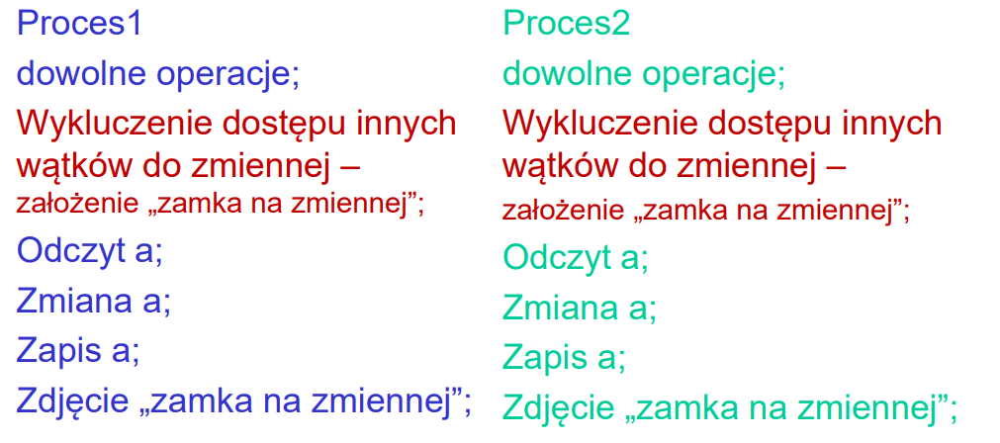

# Opracowanie PR - część sk

Opracowanie zostało przygotowane na podstawie materiałów wykadowych z przedmiotu Programowanie Równoległe (semestr 6, Politechnika Poznańska). Informacje zawarte mają na celu przybliżenie tematu zarządzania pamięcią w podczas programowania równoległego. Warto zaznaczyć, że pracować będziemy na dość niskim poziomie - przetwarzania danych na poziomie pamięci podręcznej procesora, czy też pamieci operacyjnej.

Wyjaśnienia używanych pojęć
* procesor - rozumiany będzie poprzez osobny wątek w programie działający niezależnie.
* skróty
    * PO - pamięć operacyjna
    * PPP - pamięć prodręczna procesora
    * PP - pamięć podręczna
    * T - trafienie
    * BT - brak trafienia
    * P - pobranie
    * D - dostęp

>  del miejsce na ciąg dalszy terminologi, które mogą być nieoczywite

## Podstawy
> del prezentacja 1

Przetwarzanie sekwencyjne jest dziś stosunkowo szybkie. Jednakże cały czas występuje zapotrzebowanie na wzrost wydajności przetwarzania. Wiele problemów (nawet w realnym świecie) ma swój sekwencyjny przebieg. Jednakże część każdego procesu można robić niezależnie od siebie.

Rozważmy poniższy przykład (wierzchołki oznaczają stany, a krawędzie czas przejścia pomiędzy nimi)

 

*rys. 1.1*

Przy przetwarzaniu sekwencyjnym cały proces trwa 27 jednostek czasu. W tym przypadku widać, że fragmenty
* START -> S1 -> S2 -> END
* START -> S3 -> S4 -> END

Można wykonać niezależnie od siebie stosując dodatkowy wątek. W takim przypadku czas przetwarzania wynosi odpowiednio 14 dla górnej ścieżki, oraz 13 dla dolnej. Zatem czas przetwarzania zmniejsza się o połowę. 

Przykład być może jest trywialny, jednakże przekazuje tym samym intuicję która jest wymagana do pełnego zrozumienia zagadnień przedstawionych w tym rodziale.

Istotą programowania równeległego jest zoptymalizowanie procesu przetwarzania tak, aby jak najbardziej skrócić czas potrzebny do wykonania zadania. Efektywność przetwarzania programów sekwencyjnych **nie wzrasta** w systemach wielordzeniowych i wieloprocesorowych. Rolą programisty jest poprawne wykorzystanie dodatkowych wątków procesora w komputerze. Ważne jest zapewnienie lokalności pamięci. Każdy procesor powniniem przetwarzać dane dostępne lokalnie, ponieważ dostęp do nich jest szybki. 

### Wyścig
---
Jest to sytuacja nieporządana występująca przy dostępie do pamięci współdzielonej. Do wyścigu dochodzi w przypadku niepoprawnie skonstruowanego kodu, gdzie wynik działania danych operacji jest niedeterministyczny. Jest to nadpisanie współdzielonych danych przez proces P1, które zostały wcześniej odczytanie przez proces P2 i są aktualnie wykorzystywane.

Do wystąpienia wyścigu wymagane są:
* przynajmniej 2 procesy
* zmienna współdzielona
* zapis (zmiana wartości) zmiennej współdzielonej

Przykład wyściu

*rys. 1.2*

Kod ten nie jest denerministyczny, ponieważ procesy działają niezależnie od siebie. Nie wiadomo, czy najpierw P1 wyświetli obecną wartość zmiennej A i ją wykorzysta w przetwarzaniu, czy też P2 nadpisze jej wartość. Rozwiązaniem tej sytuacji byłaby bariera synchronizacyjna (w postaci zamka), która wymusza na procesach, aby dane operacje były wykonywane sekwencyjne.

Przykład poprawnego kodu

*rys. 1.3*

Unikanie wyścigu jest konieczne, aby kod był poprawny, a wyniki deterministyczne. Nie trudno zauważyć, że zabija to współbieżność - niektóre operacje **muszą** być sekwencyjne. W ogólności natomiast wpływ zamków na spowolnienie przetwarzania w odpowiednio napisanym kodzie jest zmikomy.

### Koszta w programach równolełych
> todo
* realizacja zamka
* dostępu do pamięci
* przypisywania danych

### Cele programowania równoległego
---
* skalowalność - kolejne procesory mogą zostać dodane dla szybszego rozwiązania problemu
* wydajność - efektywnie wykorzystać dostępne procesory – uzyskać przyspieszenie względem najszybszych obliczeń na jednym procesorze
* przenośność - oprogramowanie nadające się do przenoszenia między systemami

## Pamięć w systemach wieloprocesorowych z pamięcią współdzieloną
> del prezentacja 2 (wykład 2, 42:20)

### Ograniczenia efektywności systemu pamięci
---

Pamięć operacyjna składa się z linii pamięci. Są to jednostki danych, które są pobierane do pamięci podręcznej danego procesora. Na pojedynczej linii może znajdować się wiele zmiennych (słów). Ilość ta jest zależna od typu danej zmiennej (int zajmuje 4 bajty, float 8 bajtów itd). 

> del czy słowo i zmienna w linii PP to to samo???

#### Parametry pamięci
* opóźnienie - czas odpowiedzi pamięci na żądanie danych przez procesor
* przepustowość systemu pamięci -  ilość danych dostarczana przez pamięć w jednostce czasu
* wielkość linii (wiersza) pamięci podręcznej - liczba sąsiednich słów pobierana jednorazowo do pamięci podręcznej z pamięci głównej w sytuacji, gdy w pamięci podręcznej procesora nie ma danych z interesującego procesor zakresu (realizacja kodu i brak trafienia).

#### Pobieranie danych z PO do PPP
Każdy procesor pracuje na danych pobranych wcześniej z pamięci operacyjnej. Pobierać można jedynie całe linie, dlatego też należy zwrócić uwagę, jakie jeszcze słowa występują w danej linii, ponieważ mogę one znacznie wpływać na proces przetwarzania.

*rys. 2.1*

Podczas procesu przetwarzania każdy procesor pobieta z PO niezbędne słowa. Jeżeli danej zmiennej nie ma w PPP, to występuje tzw. brak trafienia. Należy wtedy pobrać konkretne dane z PO. Nie można pobrać tylko pojedynczego słowa, pobierana jest od razu cała linia. Przykładowo proces P1 potrzebuje informacji o zmiennej X, na początku występuje brak trafnienia (zakładamy że PPP jest pusta na początku programu). Następuje zatem pobranie linii ze zmnienną X i przy okazji pobierana jest również zmienna Y.

#### Lokalność danych
* czasowa - oznacza, że dane wykorzystywane podczas przetwarzania są wykorzystywane wielokrotnie w danym okresie przetwarzania. Jeżeli pobierzemy zmienną X do pamięci podręcznej, to zmienna ta będzie wielokrotnie wykorzystywana w czasie trwania programu, przez co nie będzie trzeba ponosić kosztów z ponownym pobieraniem danych do PPP. Załóżmy sytuację sumowa wielu wartości (w pętli) do zbiorowej zmiennej SUMA. Dla zmiennej tej będzie zachowana lokalność czasowa, ponieważ w każdym wywołaniu pętli będziemy się odwoływać do tej konkretnej zmiennej (a ta już jest w PPP).
* przestrzenna - oznacza, że dane z których korzysta program są fizycznie obok siebie na linii PPP (niekoniecznie dana zmienna musi być wykorzystywana więcej niż jeden raz). Załóżmy, że przetwarzamy tablicę o wielkości 16 słów, linia pamięci niech ma wielkość 8 słów. Przy próbie odczytu pierwszego elementu następuje brak trafienia, przez co następuje pobranie linii pamięci do PPP. Kolejne 7 prób odczytu zawartości tablicy zakończy się sukcesem (ponieważ przy okazji pobrania pierwszej zmiennej, pobraliśmy kolejne wartości). W konsekwencji przy odczycie 16 zmiennych, wystąpią zaledwie 2 braki trafień.

**Ilość pocesorów VS zarządzanie pamięcią** - optymalizacja ta często nie jest prostym zadaniem, ponieważ zwiększenie ilości procesów pozwala na przespieszenie przetwarzania tylko do pewnego momentu. Złe zarządzanie pamięcią, może sprawić, że większa ilość procesorów paradoksalnie pogorszy czas wykonania programu (chociażby przez bariery synchronizacyjne). 

### Protokoły zapewnienia spójności pamięci w systemach wieloprocesorowych
---
> TODO
* Protokół unieważniania
* Protokół uaktualniania
* Protokół podglądania
* Mechanizmy katalogowe

### False sharing
---

Nieprawdziwe wpółdzielenie - sytacja powodująca dodatkowe narzuty czasowe wynikające z unieważnień kopii danych poprzez zapisy przez procesory **różnych** słów ulokowanych loficznie na tym samym obszarze linii PP. Efektem zapisu jest unieważnienie wszystkich niaktualnych kopii zapisanej linii w innych procesorach.

*rys. 2.2*

Na przykładnie rysunku 2.1 - P1 pracuje i modyfikuje zmienną X, natomiast P2 dokonuje podobnych operacji na zmiennej Y. W ten sposób wydłuż się czas dostępu do danych, oraz czas przetwarzania.

### Kategorie braków trafień do pamięci podręcznej procesora
---
> todo
* Braki trafień pierwszego dostępu
* Braki trafień wynikające z pojemności pamięci podręcznej
* Braki trafień wynikające z konfliktów 
    * xyz
    * abc

### Przenoszenie linii między poziomamy pamięci podręcznej
> todo

### Zarządzanie pamięcią przez system operacyjny
> todo
#### Pamięć wirtualna
* bufor translacji adresu (TLB)
* dostęp do pamięci

## OpenMP
> del prezentacja 3 (wykład 4, 50:00) \
> TODO

---
## Obliczenia równoległe - podstawy teoretyczne
> del prezentacja 4 (wykład 6, 53:20) \
> TODO