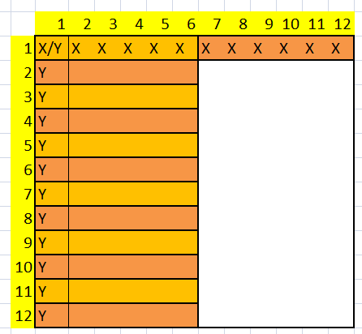
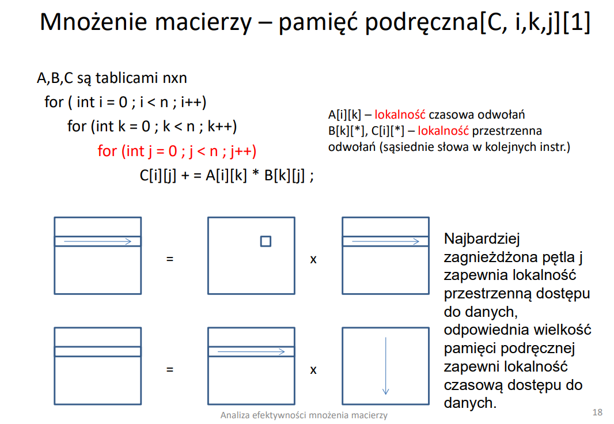
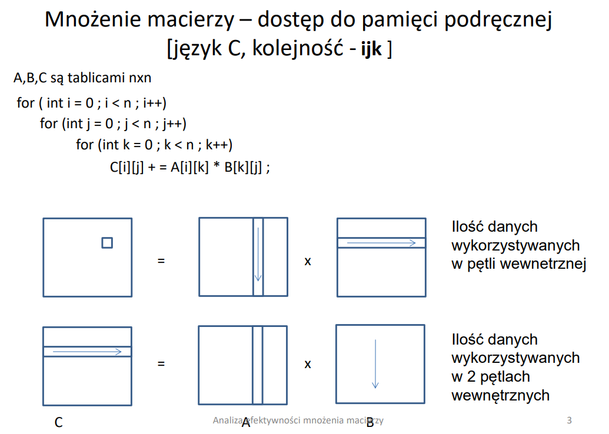
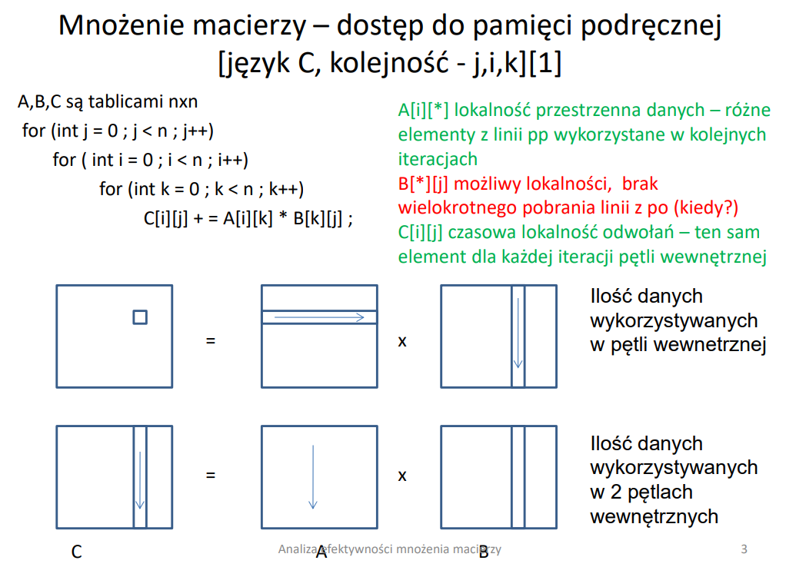
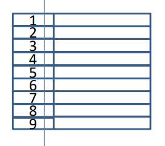
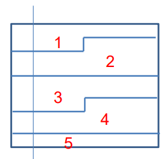
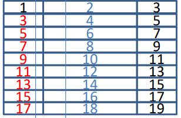

# Mnożenie macierzy

Zadanie polega na analizie procesu mnożenia macierzy przez procesor.

 \
*Zadanie 4.1*

## Wstęp

Najważniejszymmi aspektami, na które należy zwrócić uwagę w zadaniu jest lokalność danych. Najbardziej efektywne mnożenie następuje wtedy, jeśli kolejne elementy macierzy są w kolejnych wierszach. Pobierając dany element macierzy mamy pewność, że następny jest w obecnej, lub następnej linii. W przypadku, gdy kolejne elementy są w kolumnach trzeba pobierać całą linię dla pojedynczego elementu macierzy.

\
*rys 4.1*

Przyjmijmy, że linia pamięci pomieści 6 słów. Jak widać na rysunku *4.1* do pomieszczenia danych z całego wiesza potrzeba pobrać jedynie 2 linie. W przypadku pobrania całej kolumny tych linii trzeba pobrać już 12.

## Lokalność danych
* czasowa - oznacza, że dane wykorzystywane podczas przetwarzania są wykorzystywane wielokrotnie w danym okresie przetwarzania. Jeżeli pobierzemy zmienną X do pamięci podręcznej, to zmienna ta będzie wielokrotnie wykorzystywana w czasie trwania programu, przez co nie będzie trzeba ponosić kosztów z ponownym pobieraniem danych do PPP. Załóżmy sytuację sumowa wielu wartości (w pętli) do zbiorowej zmiennej SUMA. Dla zmiennej tej będzie zachowana lokalność czasowa, ponieważ w każdym wywołaniu pętli będziemy się odwoływać do tej konkretnej zmiennej (a ta już jest w PPP).
* przestrzenna - oznacza, że dane z których korzysta program są fizycznie obok siebie na linii PPP (niekoniecznie dana zmienna musi być wykorzystywana więcej niż jeden raz). Załóżmy, że przetwarzamy tablicę o wielkości 16 słów, linia pamięci niech ma wielkość 8 słów. Przy próbie odczytu pierwszego elementu następuje brak trafienia, przez co następuje pobranie linii pamięci do PPP. Kolejne 7 prób odczytu zawartości tablicy zakończy się sukcesem (ponieważ przy okazji pobrania pierwszej zmiennej, pobraliśmy kolejne wartości). W konsekwencji przy odczycie 16 zmiennych, wystąpią zaledwie 2 braki trafień.

W skrócie
* lokalność czasowa - zmienna jest wielokrotnie używana
* lokalność przestrzenna - kolejne zmienne znajdują się fizycznie na tej samej lub kolejnej linii

## Kolejność ikj

 \
*rys 4.2*

### Rozwiazanie zadań dla kolejności ikj

2A) W najbardziej wewnętrznej pętli element zostanie pobrany do pamięci raz i wielokrotnie wykorzystany (dlatego też odwołań do tej macierzy jest N^2). Pętla drugiego poziomu zapewnia lokalność przestrzenną - przechodzimy po wierszach - dzięki czemu mamy pewność, że następny element jest w tej samej lub następnej linii pamięci podręcznej.

Słowo składa się z 8 bajtów, rozmiar linii ma 64B, czyli może pomieścić 8 słów (64B / 8B = 8).
Jedynymi nietrafieniami są pierwsze odwołania się do pamięci, stosunek nietrafień wyniesie 1/8 ---> czyli stosunek trafień wynosi 7/8.
Z racji, iż lokalność czasowa jest zachowana nie ma potrzeby ponownego wczytywania linii pp, zatem stosunek trafień nie będzie pomniejszony o żadną wartość.

1) Z treści zadania wynika, że pp może pomieścić N(N+2) słów. Podczas pętli drugiego poziomu potrzebuje N dla macierzy A, N dla macierzy C, oraz N^2 dla macierzy B, dzięki czemu całość obliczeń może zostać pomieszczona w pp podczas wykonywania obliczeń, czyli nie będzie wymagane ponowne pobranie jakiegokolwiek elementu.

Zwolnione będą tylko elementy macierzy C, oraz A, których dane nie będą w przyszłości wykorzystywane. To zapewnia lokalność czasową.

2C) Dla macierzy C stosunek trafień wynosi 15/16, ponieważ podczas pojedynczego działania mamy 2 dostępu C += A * B ---> C = C + A * B

2B) Odwołań do macierzy B jest n^3. Po pierwszej iteracji najbardziej zewnętrznej pętli cała macierz B jest już w pamięci. Będzie ona wykorzystywana w całości na każdej kolejnej iteracji, dlatego pozostaje ona w pamięci (mamy pewność, że dane się zmieszczą z treści zadania). Dlatego należy uwzględnić jedynie braki trafień w przypadku pierwszej iteracji pętli najbardziej zewnętrznej.

Stosunek trafień:
1 - { N * (N / 8) / N^3 } = 1 - { (N^2 / 8) / N^3 } = 1 - 1 / (N*8)

## Kolejność ijk

 \
*Zadanie 4.2*

 \
*rys 4.3*

### Rozwiązanie zadań dla kolejności ijk

Podobnie jak we wcześniejszym przykładzie linia pp jest w stanie pomieścić 16 słów.
Dostępy do pamięci:
* dla macierzy A i B - N^3
* dla macierzy C - 2N^2

Pamięć podręczna ma rozmiar 16N bajtów, co dane 4N słów. Pomiedzy dostępami do tego samego elementu macierzy C zapisujemy N słów przy macierzy A, oraz 16N słówm czyli więcej niz ppp = 4N. Wynika stąd, że stosunek trafień ST = 0.

> Liczenie stosunku trafień ma sens (czyt. będzie większe niż 0), jeśli pamięć podręczna jest w stanie pomieścić wystarczającą ilość potrzebnych danych.

## Kolejność jik

 \
*rys 4.4*

> todo

