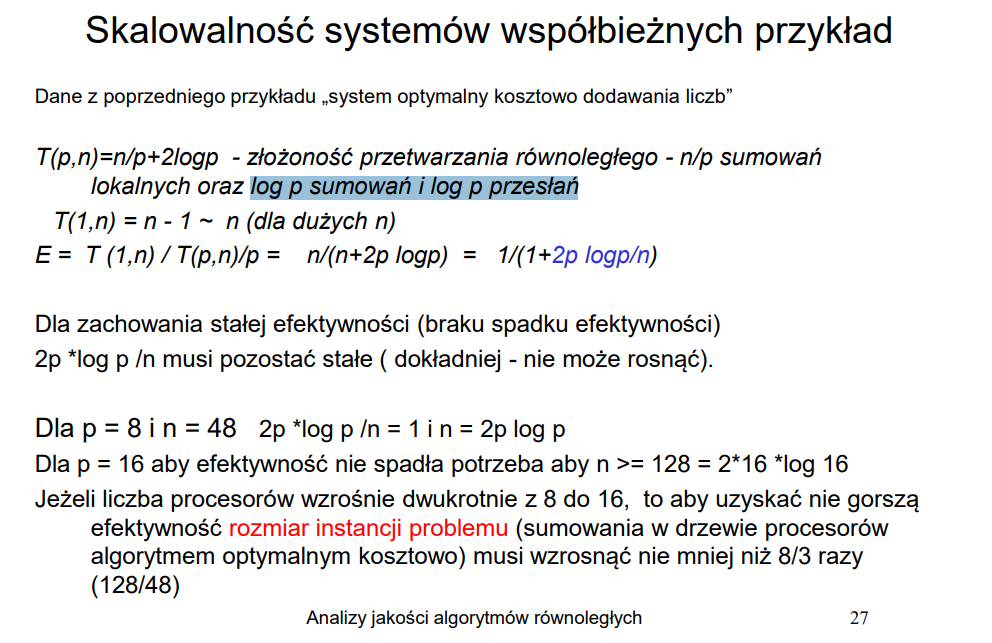
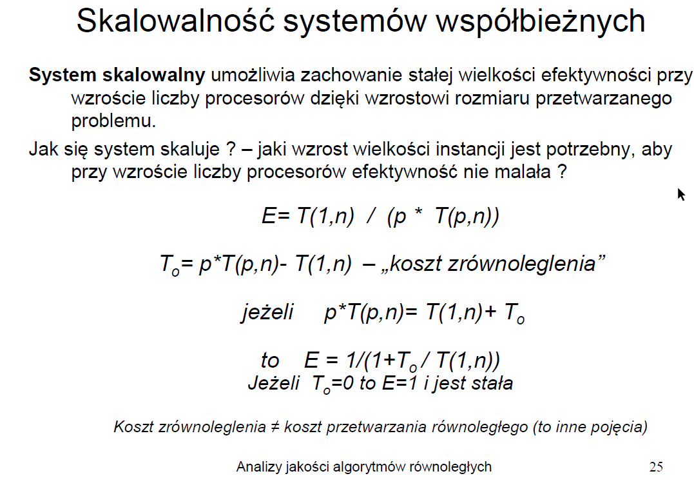
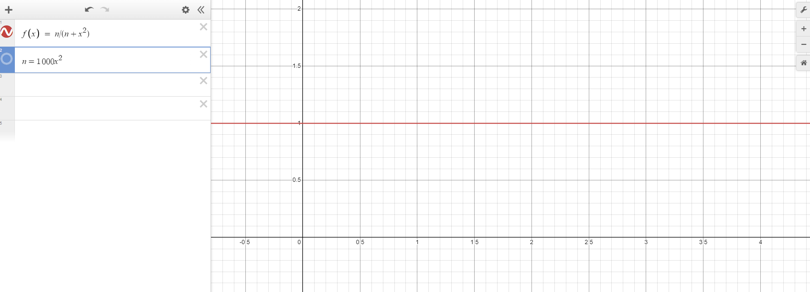

# Zastosowanie algorytmów

 \
*Zadanie 5.1*

 \
*Zadanie 5.2*

## Wstęp

W zadaniu badada się wpływ wielkości problemu, oraz ilości procesorów na efekrywność. W odróżnieniu od zadania 2 tutaj musimy jeszcze uwzględniać algorytm który stosujemy. Rozważamy problemy sumowania liczb, oraz szukania maksimum. W zależności od struktry zmienia się koszt, który należy uwzględnić przy obliczaniu efektywności. 

> Dla każdego rozważanego problemu przetwarzanie sekwencyne wynosi N

Struktury stosowane w zadaniu i ich koszt T(n,p), zakładamy jednostkowy czas wykonania operacji:
* hiperkostka  i drzewo binarne (wzór zależy od czynności, które uwzględniamy w zadaniu, np. dodatkowe sumowanie, czy przesył danych)
    * $n/p + log_2(p)$ 
    * $n/p + 2log_2(p)$ 
* pierśnień jednokierunkowy
    * $n/p + p$

### Skąd te wzory, co oznaczają?

W powyższych wzorach zawarta jest informacja o kosztach pracy które ponosi każdy pojedynczy proces w przetwarzaniu równoległym. Zadanie (o złożoności **N**) jest dzielone po równo na każdy procesor (jest och **p**) - dlatego też pierwszy człon każdego równania to n/p - jest to czas potrzebny do wykonania idealnie podzielonego problemu na daną liczbę procesorów. Jednakże każde zadanie wymaga dodatkowych kosztów (związanych z przesyłaniem danych pomiędzy procesorami itp), dlatego też występuje ciąg dalszy równania po znaku sumy (bez tej dodatkowej części efektywność byłaby maksymalna, czyt. nie tracimy nic na podziale zadania). W zależności od algorytmu, architektury, oraz problemy mamy różne rodzaje dodatkowych kosztów.

Mnożnik przed kosztem może się różnić w zależności od tego co uwzględniami w kosztach. Przykładowo sumowanie dla hiperkostki może mieć dodatkowy koszt w postaci $2log_2(p)$ z powodu $log_2(p)$ dodatkowych sumowań, oraz $log_2(p)$ przesłań.

> todo - jakaś tabela która obrazuje każdy przypadek 

> Uwaga - na mój obecny stan wiedzy, nie ma różnynicy w złożonościach pomiędzy sumowaniem, a znajdowaniem maksimum

## Efektywność

---

### Kluczowe wzory

## $E_1 = E_2 \leftrightarrow { {T_{O1} \over T(1,n_1)} = {T_{O2} \over T(1,n_2)} }$ 
## $T_O = p \times T(p,n) - T(1,n)$
$T_O$ - koszt zrónoleglenia 

## Rozwiązanie zadania 5.1

### Dane
* Sekwencyjne: T(1,n) = N
* Równoległe: T(p,n) = N/p + log2p

$T_O = p \times log_2(p) - N$

$T(1,n) = N $

## ${ {T_{O1} \over T(1,n_1)} = {T_{O2} \over T(1,n_2)} }$ 

${ T_{O1} \times T(1,n_2) = T_{O2} \times T(1,n_1) }$

$N_2 \times p_1 \times log_2{p_1} - N_2 \times N_1 = N_1 \times p_2 \times log_2{p_2} - N_1 \times N_2$

$p_1 = 256$

$p_2 = 1024$

$N_2 = N_1 \times {10240 \over 2048}$

## $N_2 = 5 N_1$

Odp.: Wiekość sumowanego zbioru powinan zwiększyć się 5 razy.

> Efektywność spada wraz ze wzrostem liczby procesotów, więc aby utrzymać stałą efektywność należy zwiększyć instację problemu (patrz prawo Amdahla / Gustafsona).

Warto zauważyć, że 
## $N_2 = { p_2 \times log_2{p_2} \over p_1 \times log_2{p_1} } \times N_1$

czyli

## $N_2 = { p2 \times T(p_2,n_2) \over p1 \times T(p_1,n_1) } \times N_1$

---

## Rozwiązanie zadania 5.2

* Równoległe: T(p,n) = N/p + p

### Efektywność
E = T(1,n) / `(`p*T(p,n)`)` = N / `(`N + p^2`)`  
E = 1 / `(`1+p^2/N`)`  
Funkcja stałej efektywności: k * p^2 / N  
E1 = E2  
1 / `(`1+p1^2/N1`)` = 1 / `(`1+p2^2/N2`)`  
p1^2/N1 = p2^2/N2  
N2/N1 = (p2/p1)^2 = (1024/256)^2 = 16  
<b>Wielkość sumowanego zbioru powinna wzrosnąć 16-krotnie.</b>

---

## Rozwiązanie zadania 5.3

 \
*Zadanie 5.3*

Zadanie trochę inne od tych wcześniejszych.

Ts - część sekwencyjna
Tr - część równoległa

E - efektywność

p - liczba procesorów
N - wielkość instancji

----------------------------------------------------

$Ts = N$

$Tr = N/p + p$ (lub 3p, gdy uwzględnimy komunikację, nie wpływa to jednak na wynik końcowy)

$E = Ts / p*Tr$

$E = N / (N + p^2)$

$max(E) = 1$

dla p = 1:

$N+1 ~= N$, dlatego też

$E = N/(N+1) ~= N/N = 1$

Jest to maksymalna wartość efektywności. Żeby ją utrzymać należy zwiększać instancję problemu **N**.
Jeśli $E = N / (N + p^2)$, to wzrost **N** w zależności od **p** powinien wynosić $N = M*p^2$, gdzie **M** do duża liczba całkowita.
Czyli ostatecznie - wielkość instancji powinna rosnąć co najmniej wg funkcji kwadratowej.

